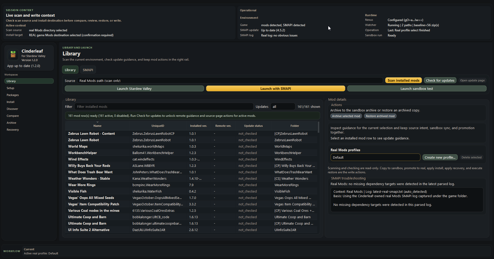
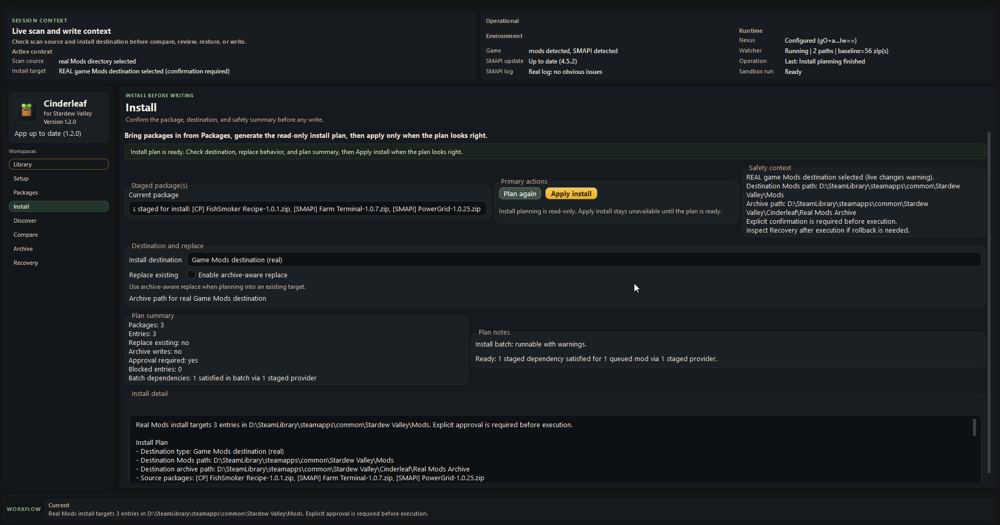
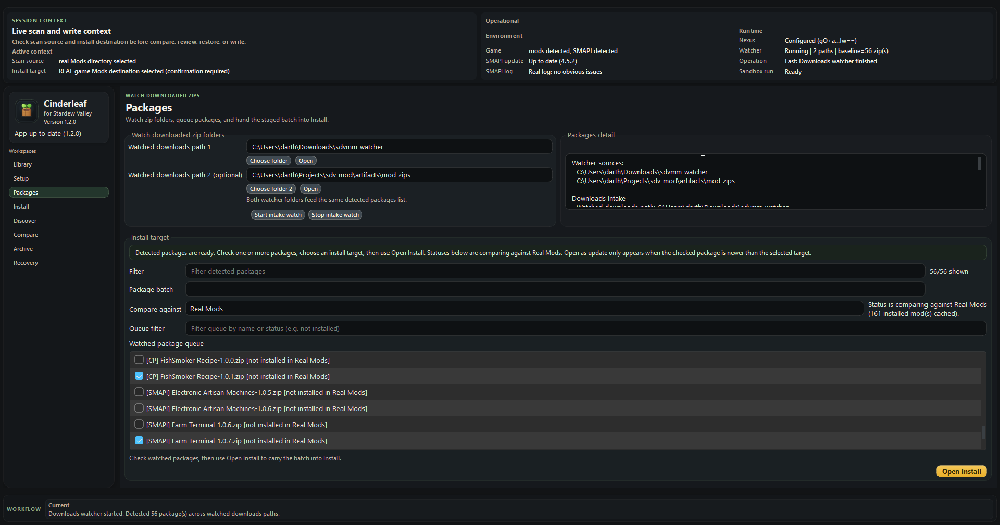
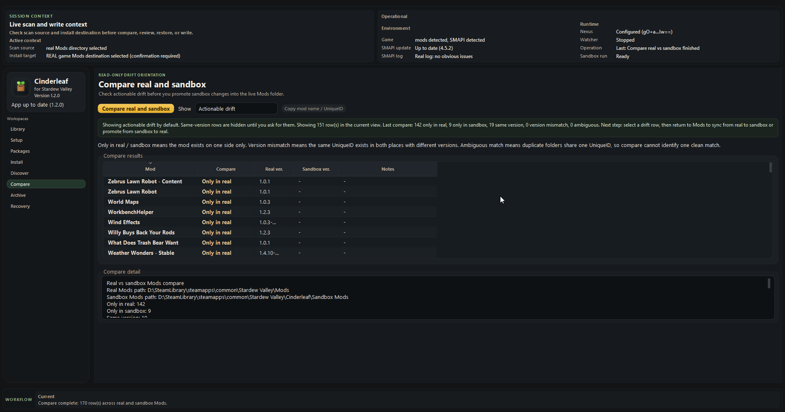
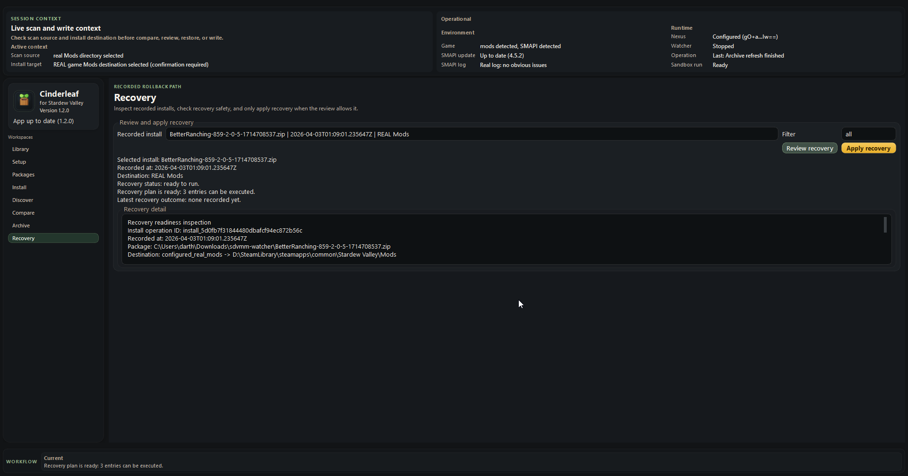
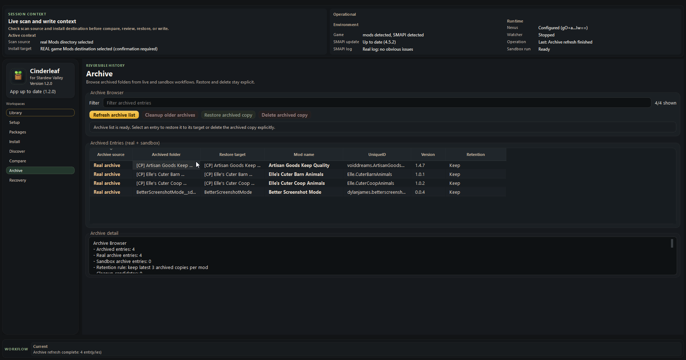

# Cinderleaf

**Cinderleaf** is a local-first mod manager **for Stardew Valley**. It is built for players who want an easier, calmer way to install, organize, and keep using mods: let the watcher pick up downloads, plan changes before writing anything, keep favorite profiles around, export backups when needed, and keep recovery tools nearby in case something goes wrong.

`for Stardew Valley` is a descriptive subtitle, not an official affiliation. Cinderleaf is an independent community tool and is not affiliated with or endorsed by ConcernedApe.

Current project version: **1.2.0**

If you want the full step-by-step walkthrough, start with the [User Manual](docs/USER_GUIDE.md).

## Why people use Cinderleaf

- to make mod installs feel easier and less chaotic
- to let the watcher pick up downloaded zip files for them
- to review installs before writing files
- to queue and install several downloaded mods together
- to manage alternate mod profiles without losing a favorite setup
- to export backups before a cleanup, migration, or riskier change
- to compare real and sandbox folders without turning Compare into a write tool
- to keep archive, recovery, and restore tools within easy reach
- to go from a simple casual setup to a more curated, experimental, or mod-author workflow without changing tools

## Core features

- `Library` for scanning installed mods, checking updates, handling the main launch actions, and working with your installed library
- `SMAPI` for SMAPI-specific helpers such as log checks, troubleshooting, and related actions
- watcher-first `Packages` intake with batch selection and queue filtering
- `Install` planning before any write, including dependency-aware batch planning
- curated real and sandbox profiles, with clear `not in profile` behavior for mods that exist in `Default` but are not part of a custom profile yet
- read-only `Compare` for checking drift between real and sandbox mod folders
- archive, recovery, and restore/import tools for reversible workflows
- backup bundle export with artifact selection, including:
  - manager state and profiles
  - managed mods and config snapshots
  - archives
  - optional Stardew save files
- restore/import support for bundled mods, mod configs, and exported profile catalogs, with save files left as a manual restore step
- optional sandbox and testing workflows for safer experiments, heavier tinkering, and mod-author use cases

## New in 1.2.0

- Curated real and sandbox profiles are now part of the normal workflow.
- `Packages` is now watcher-first, and `Install` can plan and apply a batch instead of forcing one package at a time.
- Batch planning understands staged dependencies better.
- Backup export now lets you choose what to include, including optional save files.
- The app has a cleaner identity, clearer workspace names, and stronger low-height polish.
- SMAPI launch/log handling and profile-operation flow are more reliable.

For the full release history, see [CHANGELOG.md](CHANGELOG.md).

## Screenshots

These screenshots reflect the `1.2.0` UI.













## Requirements

- Windows
- Stardew Valley
- SMAPI for most modded setups

## Download the portable build

The supported public build is a Windows portable zip published on GitHub Releases.

1. Open the repository's [GitHub Releases page](https://github.com/meiameiameia/Cinderleaf/releases).
2. Download `cinderleaf-1.2.0-windows-portable.zip`.
3. Extract it to a normal folder.
4. Run `Cinderleaf.exe`.

If a checksum file is published with the release, verify `cinderleaf-1.2.0-windows-portable.zip.sha256` before announcing or mirroring the build.

Good to know:

- this is a portable folder, not an installer
- Windows reputation prompts are still expected because code signing is not in place yet
- Cinderleaf can tell you when a newer release exists, but it does not download or install updates for you

## A simple way to use it

1. Set your game folder, real `Mods`, and sandbox `Mods` in `Setup`.
2. Let `Packages` watch your download folders and queue the mods you want to work with.
3. Open `Install` and read the plan before you apply anything.
4. Use `Library` to keep track of what is installed and use its launch actions when you are ready to play or test.
5. Use `SMAPI` when you want log checks, troubleshooting help, or other SMAPI-specific helpers.
6. Use `Compare` when you want to see what is different between real and sandbox.
7. Use archive, recovery, restore/import, and backup/export tools before bigger cleanups, experiments, or machine moves.

If you mainly want an easier everyday mod routine, Cinderleaf is built for that. If you make mods, troubleshoot often, or like heavier experimentation, the sandbox gives you a dedicated place to test changes first.

## Want the full walkthrough?

The [User Manual](docs/USER_GUIDE.md) covers setup, packages, installs, profiles, backups, compare, recovery, restore/import, and troubleshooting in more detail.

## Build from source

```powershell
py -3.12 -m venv .venv
.\.venv\Scripts\python.exe -m pip install -U pip
.\.venv\Scripts\python.exe -m pip install -e ".[dev,build]"
.\.venv\Scripts\python.exe -m pytest tests\unit -q
.\.venv\Scripts\python.exe scripts\build_windows_portable.py
```

The build script produces:

```text
dist\cinderleaf-1.2.0-windows-portable\
dist\cinderleaf-1.2.0-windows-portable.zip
dist\cinderleaf-1.2.0-windows-portable.zip.sha256
```

## Current limitations

- downloads are still manual; the watcher can monitor folders you choose, but it does not download from mod sites for you
- `Compare` is intentionally read-only; it helps you review drift, not write changes
- restore/import is archive-aware and folder-oriented; it is not a file-by-file merge tool
- exported profile catalogs can now be restored through restore/import, but Stardew save files still need manual restore steps
- there is no one-click `sync everything back to real` flow
- Windows is the primary supported desktop path today

## Feedback and issue reporting

- use GitHub Issues for bugs and feature requests
- include the Cinderleaf version, Windows version, and which workspace or workflow was involved
- if the issue involves install, archive, recovery, restore/import, or SMAPI troubleshooting, include the status text, plan summary, or error message shown by the app
- code contributions and pull requests are not being actively accepted right now

## License

Cinderleaf is **source-available**, not open source.

This repository is licensed under **PolyForm Noncommercial 1.0.0**. You can use, modify, and redistribute it for noncommercial purposes under the terms in [LICENSE](LICENSE).

## Project files

- [User Manual](docs/USER_GUIDE.md)
- [Changelog](CHANGELOG.md)
- [Feedback and issue notes](CONTRIBUTING.md)
- [License](LICENSE)
